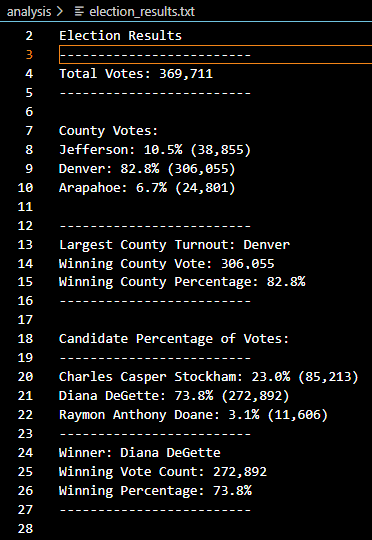

# Election_Analysis
## Overview of Project: 
The Colorado Board of Elections has requested an election audit of a recent local congressional election.
1.	Calculate the total number of votes cast.
2.	Get a complete list of candidates who received votes.
3.	Calculate the total number of votes each candidate received.
4.	Calculate the percentage of votes each candidate won.
5.	Determine the winner of the election based on popular vote.
6.	Determine the voter turnout for each county.
7.	Determine the percentage of votes from each county out of the total count.
8.	Determine the county with the highest voter turnout.

### Election-Audit Results: 

•	**How many votes were cast in this congressional election?**

  369,711 total votes.
  
  
•	**Provide a breakdown of the number of votes and the percentage of total votes for each county in the precinct.**

**County Votes:**
Jefferson: 10.5% (38,855)
Denver: 82.8% (306,055)
Arapahoe: 6.7% (24,801)

•	**Which county had the largest number of votes?**

**Largest County Turnout:** Denver
**Winning County Vote:** 306,055
**Winning County Percentage:** 82.8%

•	**Provide a breakdown of the number of votes and the percentage of the total votes each candidate received.**

**Candidate Percentage of Votes:**
Charles Casper Stockham: 23.0% (85,213)
Diana DeGette: 73.8% (272,892)
Raymon Anthony Doane: 3.1% (11,606)

•	**Which candidate won the election, what was their vote count, and what was their percentage of the total votes?**

**Winner:** Diana DeGette
**Winning Vote Count:** 272,892
**Winning Percentage:** 73.8%
